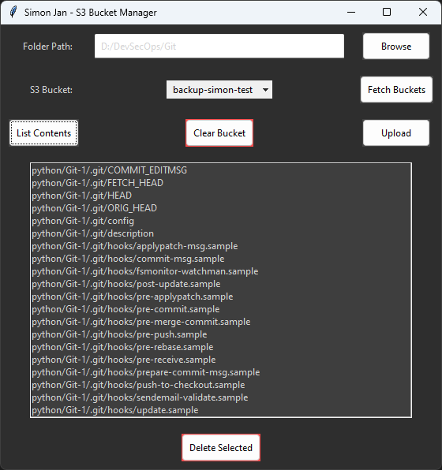

# S3 Bucket Manager



## Table Of Contents
- [S3 Bucket Manager](#s3-bucket-manager)
  - [Table Of Contents](#table-of-contents)
  - [Overview](#overview)
  - [Key Features](#key-features)
  - [User Interface](#user-interface)
  - [How to Use](#how-to-use)
  - [Technical Summary](#technical-summary)
  - [Prerequisites](#prerequisites)
  - [Installation](#installation)
  - [Running the Application](#running-the-application)
  - [Security Considerations](#security-considerations)
  - [Additional Notes](#additional-notes)

## Overview

The S3 Bucket Manager is a web-based application that provides a user-friendly interface for interacting with Amazon S3 buckets. Built using Flask and Boto3, this application allows users to manage their S3 buckets efficiently through a web browser.

## Key Features

1. **Fetch and Select S3 Buckets**: View and select from available S3 buckets.
2. **Upload Folders to S3**: Upload local folders to the selected S3 bucket.
3. **List Bucket Contents**: View all files and folders in the selected bucket.
4. **Clear Bucket**: Delete all contents of the selected bucket.
5. **Delete Specific Items**: Remove individual files or folders from the bucket.

## User Interface

- **Web-based Interface**: Accessible through any modern web browser.
- **Responsive Design**: Adapts to different screen sizes for desktop and mobile use.

## How to Use

1. Open the application in a web browser.
2. Use the dropdown to select an S3 bucket.
3. Upload folders, list contents, clear buckets, or delete specific items using the provided buttons.

## Technical Summary

- **Backend**: Python with Flask
- **AWS Interaction**: Boto3
- **Frontend**: HTML, CSS, JavaScript

## Prerequisites

- Python 3.9 or higher
- Docker (for containerized deployment)
- AWS Account with S3 access

## Installation

1. Clone the repository:
   ```
   git clone https://github.com/your-username/s3-bucket-manager.git
   cd s3-bucket-manager
   ```

2. Build the Docker image:
   ```
   docker build -t s3-bucket-manager .
   ```

## Running the Application

Run the Docker container, providing your AWS credentials:

```
docker run -p 5000:5000 \
  -e AWS_ACCESS_KEY_ID=your_access_key \
  -e AWS_SECRET_ACCESS_KEY=your_secret_key \
  s3-bucket-manager
```

Access the application at `http://localhost:5000` in your web browser.

## Security Considerations

- Never commit AWS credentials to version control.
- Use environment variables to pass AWS credentials to the application.
- Consider using IAM roles for enhanced security in production environments.

## Additional Notes

- Ensure your AWS credentials have the necessary permissions for S3 operations.
- For production use, consider setting up HTTPS and implementing user authentication.
